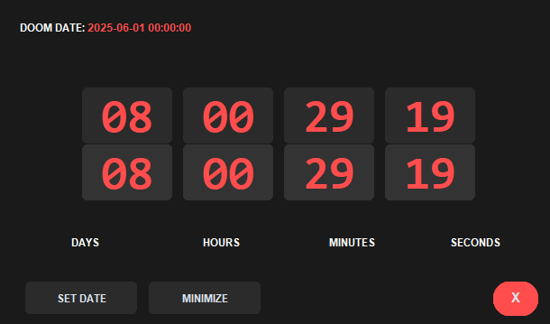

<div align="center">
  <h1>⏳ Doom Counter</h1>
  <p>A sleek, always-on-top countdown timer with flipping animations and compact mode</p>
  
  [](https://www.python.org/downloads/)
  [](https://opensource.org/licenses/MIT)
  [](https://github.com/AnujJha88/DoomCounter/stargazers)
  
  
</div>

## ✨ Features

- 🎨 **Dark Theme** with red accents for a "doomsday" feel
- 🔄 **Smooth Animations** with flipping number effects
- 📌 **Always on Top** - Never lose track of your countdown
- 🖥️ **Compact Mode** - Minimize to a small, unobtrusive bar
- ⏱️ **Real-time Updates** - Updates every second
- 🖱️ **Draggable** - Move the window by clicking and dragging
- 📅 **Easy Date Setting** - Set any future date with a simple dialog

## 🚀 Getting Started

### Prerequisites
- Python 3.12.5 
- CustomTkinter
- Pillow (PIL)

### Installation

1. **Clone the repository**
   ```bash
   git clone https://github.com/AnujJha88/DoomCounter.git
   cd DoomCounter
   ```

2. **Install dependencies**
   ```bash
   pip install -r requirements.txt
   ```
   
   Or install them manually:
   ```bash
   pip install customtkinter pillow
   ```

3. **Run the application**
   ```bash
   python main.py
   ```

## 🎮 Usage

1. **Set Your Doom Date**
   - Click "SET DOOM DATE"
   - Enter date and time in format: `YYYY-MM-DD HH:MM:SS`
   - Example: `2025-12-31 23:59:59`

2. **Minimize/Restore**
   - Click "MINIMIZE" to switch to compact mode
   - Click "RESTORE" in compact mode to return to full view

3. **Move the Window**
   - Click and drag anywhere on the window to move it

4. **Close the Application**
   - Click the "X" button or press `ESC`

## 📦 Building an Executable

Create a standalone .exe file using PyInstaller:

```bash
# Install PyInstaller if you haven't already
pip install pyinstaller

# Build the executable
pyinstaller --onefile --windowed --icon=NONE --name "DoomCounter" main.py

# The executable will be in the 'dist' folder
```

I also include a prebuilt executable for ease of access.

## 🚀 Running on System Startup

### For Windows:

#### Method 1: Using the Startup Folder (Easiest for current user)

1. Press `Win + R` to open the Run dialog
2. Type `shell:startup` and press `Enter`
3. Create a shortcut to your `DoomCounter.exe` in this folder

#### Method 2: Using Task Scheduler (More Robust & Flexible)

1. Search for "Task Scheduler" in the Start menu
2. In the right-hand "Actions" pane, click "Create Basic Task..."
3. Follow the wizard to create a task that runs `DoomCounter.exe` on startup

### For macOS:

1. Go to `System Settings` > `General` > `Login Items`
2. Click the `+` button and select the `DoomCounter` app

### For Linux:

#### Using systemd (Recommended for most Linux distributions):

1. Create a service file at `~/.config/systemd/user/doomcounter.service`:
   ```ini
   [Unit]
   Description=Doom Counter Application
   After=graphical.target

   [Service]
   ExecStart=/path/to/DoomCounter
   Restart=always
   
   [Install]
   WantedBy=default.target
   ```

2. Enable and start the service:
   ```bash
   systemctl --user enable --now doomcounter.service
   ```

## 🔍 Troubleshooting

- **Application doesn't start or crashes:**
  - Ensure all dependencies are installed
  - Check that the executable has proper permissions
  - Run from command line to see any error messages

- **Window is not always on top:**
  - Some window managers might override the 'always on top' setting
  - Try running as administrator (Windows) or with sudo (Linux/macOS)

## 🛠️ Customization

You can customize the appearance by modifying these variables in `main.py`:

```python
# Colors
self.bg_color = "#1a1a1a"      # Background color
self.fg_color = "#ff4d4d"      # Main accent color (red)
self.text_color = "#ffffff"    # Text color
self.accent_color = "#ff1a1a"  # Secondary accent color (darker red)
self.button_bg = "#2b2b2b"     # Button background
```

## 📂 Project Structure

```
DoomCounter/
├── main.py            # Main application code
├── requirements.txt    # Python dependencies
├── README.md          # This file
├── build/             # Temporary files created by PyInstaller
├── dist/              # Contains the compiled executable
└── screenshots/       # Screenshots and previews
    └── preview.png
```

## 🤝 Contributing

Contributions are what make the open-source community such an amazing place to learn, inspire, and create. Any contributions you make are **greatly appreciated**.

1. Fork the Project
2. Create your Feature Branch (`git checkout -b feature/AmazingFeature`)
3. Commit your Changes (`git commit -m 'Add some AmazingFeature'`)
4. Push to the Branch (`git push origin feature/AmazingFeature`)
5. Open a Pull Request

## 📄 License

Distributed under the MIT License. See `LICENSE` for more information.

## 📧 Contact

Anuj Jha - [@AnujJha571205](https://x.com/AnujJha571205) - aj472032@gmail.com

Project Link: [https://github.com/AnujJha88/DoomCounter](https://github.com/AnujJha88/DoomCounter)

## 🙏 Acknowledgments

- [CustomTkinter](https://github.com/TomSchimansky/CustomTkinter) - For the beautiful UI components
- [Python](https://www.python.org/) - For being awesome
- [You] - For using this application!

---

<div align="center">
  Made with ❤️ and Python
</div>
